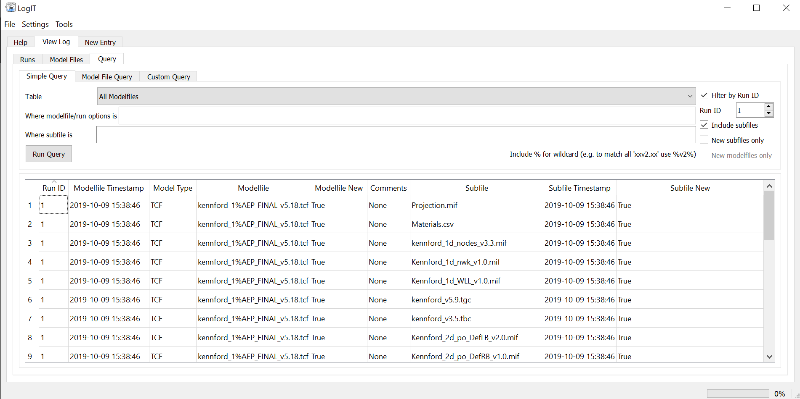
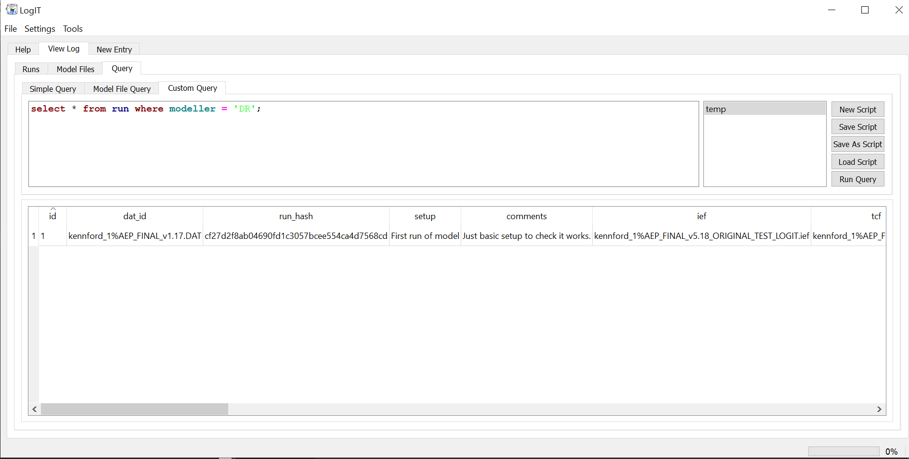
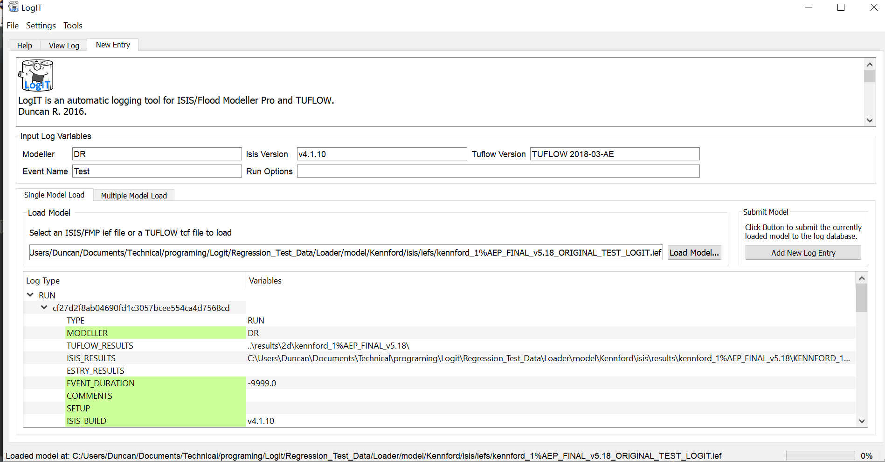

# LogIT

Logger for Flood Modeller Pro and Tuflow-Estry models.

Application for loading Flood Modeller Pro and Tuflow models into a database for logging, viewing
and interrogation. Automatically load all the data related to a specific model and track the files
used in the model, run details and easily find which files were used in which run. You can export
the database to an Excel workbook at any time.

Packaged executables are included under the "Releases" tab for download, these
can be run directly without installation.

## Table of Contents (Optional)

- [Installation](#installation)
- [Features](#features)
- [Screenshots](#screenshots)
- [Contributing](#contributing)
- [License](#license)

## Installation

- You can download a zip file containing an executable from the 
  <a href="https://github.com/ErmeviewEnvironmentalLtd/LogIT/releases">Releases page</a>. 
  This can be unzipped anywhere on your computer then double-click the LogIT.exe application to 
  run, no installation necessary.
- Clone this repo and set it up yourself. There are two requirements files; If you only need to run 
  the software use requirements.txt, if you want to be able to build the executable too use
  requirements_with_pyinstaller.txt

## Features

- Log Flood Modeller Pro 1D models only, tuflow only or combined Flood Modeller / Tuflow models
  by loading an .ief or .tcf file.
- View information about a model including all the files associated with it, when specific files
  were first used (model files like .tgc/.tbc/etc and gis files, or boundary files) or query
  specific components of the model.
- Compare different models and their contents.
- Run your own queries to view whatever information you want.
- Record additional notes on files
- Automatically update .ief file paths from models you've copied in to make the paths work in 
  a new location.
  
## Screenshots

Querying example:

Complex query example:

Model load example:

## Contributing

If you want to contribute to LogIT make a fork of the repo. It's probably best to let me know what
you're working on to ensure that it's not already being done and fits with the plans for the 
software.

## License

- **[GPL v2 license](https://www.gnu.org/licenses/old-licenses/gpl-2.0.en.html)**
- Copyright 2019 © <a href="http://ermeviewenvironmental.co.uk" target="_blank">Ermeview Environmental Solutions</a>.